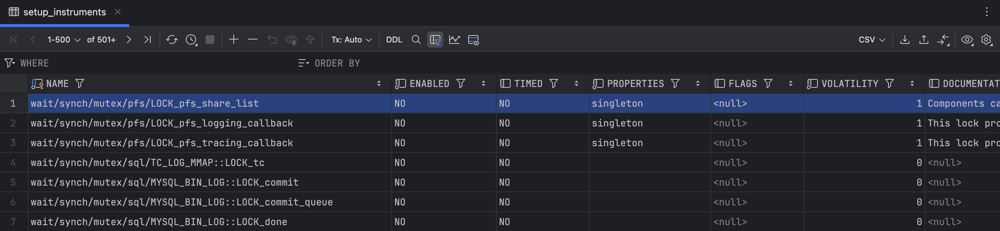

# 성능 스키마 (Performance Schema)

## 성능 스키마 소개
MySQL 서버 내에서 실행되는 작업에 대한 **상세한 메트릭**을 제공하는 기능입니다.

- **인스트루먼트 (Instrument)**: 정보를 얻고자 하는 MySQL 코드의 특정 부분
- **컨슈머 (Consumer)**: 수행된 코드의 정보를 저장하는 단순한 테이블입니다. 컨슈머는 쿼리를 수행하며, 총 실행 횟수, 인덱스가 사용되지 않은 횟수, 수행 시간 등의 정보를 기록합니다.

---

### 인스트루먼트 요소
`performance_schema`의 `setup_instruments` 테이블에는 지원되는 모든 인스트루먼트 목록이 포함되어 있습니다.



- 인스트루먼트 이름의 가장 왼쪽 부분이 **인스트루먼트의 종류**를 나타냅니다.
- 대부분의 인스트루먼트 이름은 그 자체로 설명이 되며, `Documentation` 열에 더 자세한 설명이 포함되어 있습니다.

---

## 컨슈머 체계
_current: 현재 서버에서 발생하고 있는 이벤트
_history: 스레드당 최종 10개의 완료된 이벤트
_history_long: 전역으로 스레드당 최종 10,000개의 완료된 이벤트

events_waits: 뮤텍스 획득과 같은 로우-레벨 서버 대기
events_statements: SQL문
events_stages: 임시 테이블 생성이나 데이터 전송과 같은 프로파일 정보
events_transactions: 트랜잭션들


### 주요 컨슈머 테이블
`performance_schema`에서 제공하는 주요 컨슈머 테이블은 다음과 같습니다:

- **global_instrumentation**: 글로벌 레벨에서 수집할 데이터를 지정합니다.
- **events_statements_history**: 각 세션의 쿼리 이력을 수집하며, 특정 세션에서 실행된 SQL 문에 대한 정보를 기록합니다.
- **events_statements_history_long**: `events_statements_history`보다 더 긴 기록을 유지합니다. 
- **events_stages_history**: 각 세션의 스테이지(단계)별 이벤트 이력을 수집합니다.
- **events_stages_history_long**: `events_stages_history`와 동일하지만 더 긴 기록을 유지합니다.
- **events_waits_history**: 각 세션에서 발생하는 대기 이벤트를 수집하며, 대기 시간이나 자원 사용 시간에 대한 정보를 제공합니다.
- **events_waits_history_long**: `events_waits_history`와 유사하게 대기 이벤트를 더 긴 기록으로 유지합니다.
- **실시간 모니터링 테이블**:
  - `events_statements_current`, `events_stages_current`, `events_waits_current`: 현재 세션에서 발생한 이벤트의 상태를 실시간으로 보여줍니다.

---

### 주요 컨슈머 테이블 예시
`setup_consumers` 테이블은 `performance_schema`의 모든 컨슈머를 제어하는 테이블입니다. 각 행은 특정 컨슈머의 활성화 여부를 나타내며, 데이터는 `YES` (활성화) 또는 `NO` (비활성화)로 표시됩니다.

| NAME                      | ENABLED |
|---------------------------|---------|
| events_statements_history | YES     |
| events_statements_history_long | NO  |
| events_stages_history     | YES     |
| events_waits_history_long | NO      |

---

### 컨슈머 테이블의 활용
1. **성능 모니터링 최적화**: 필요한 데이터만 수집하여 MySQL 서버의 성능을 최적화합니다. 예를 들어, 특정 쿼리의 대기 이벤트만 보고 싶다면, 관련된 대기 이벤트 컨슈머만 활성화할 수 있습니다.
2. **실시간 모니터링**: 현재 이벤트 테이블을 통해 실시간으로 SQL, 대기 상태, 단계 이벤트를 모니터링할 수 있습니다.
3. **이벤트 저장소 관리**: `history_long` 테이블을 활성화하면 이벤트 저장 기록을 더 길게 유지하여 장기적인 분석에 유리하지만, 데이터 저장소와 서버 자원이 더 많이 소모될 수 있습니다.

---

## 참고 사항

기본적으로 **필요한 최소한의 컨슈머만 활성화**하여 서버의 부하를 줄이는 것이 좋습니다.

컨슈머 설정은 `UPDATE` 명령으로 조정할 수 있으며, 예를 들어 `events_statements_history`를 비활성화하려면 다음과 같이 설정할 수 있습니다:

```sql
UPDATE setup_consumers SET ENABLED = 'NO' WHERE NAME = 'events_statements_history';
```

## 요약 테이블 (Summary Tables)과 다이제스트 테이블 (Digest Tables)

### 1. 요약 테이블 (Summary Tables)
요약 테이블은 서버 이벤트 데이터를 집계하여 성능을 모니터링할 수 있도록 돕는 테이블입니다. 각 요약 테이블은 특정 조건이나 기준에 따라 이벤트의 발생 횟수, 시간, 평균 시간 등의 지표를 기록합니다. 이를 통해 **쿼리 실행 빈도**, **대기 시간**, **스테이지별 상태** 등을 쉽게 파악할 수 있습니다.

#### 주요 요약 테이블 유형
- **`events_statements_summary_by_` 테이블**: SQL 문에 대한 요약 정보를 제공합니다. 예를 들어, `events_statements_summary_by_digest`는 SQL 문 유형별로 발생 횟수와 평균 실행 시간을 기록합니다.
- **`events_stages_summary_by_` 테이블**: 각 쿼리 스테이지 단계에 대한 요약 정보를 제공합니다. 쿼리가 어떤 단계에서 오래 걸리는지 파악할 때 유용합니다.
- **`events_waits_summary_by_` 테이블**: 대기 이벤트에 대한 요약을 제공합니다. 자원 접근 대기나 파일 I/O와 같은 이벤트에 대해 집계된 데이터를 제공합니다.

#### 요약 테이블 사용 예시
- SQL 문 실행 시간의 평균값을 확인하거나, 대기 이벤트가 가장 많이 발생하는 유형을 파악하는 데 사용할 수 있습니다.
- 예를 들어, 쿼리 유형별 성능을 비교할 수 있는 테이블에서 **SELECT**와 **UPDATE** 문이 얼마나 자주 실행되었는지, 각각의 평균 실행 시간은 얼마인지를 확인할 수 있습니다.

---

### 2. 다이제스트 테이블 (Digest Tables)
다이제스트 테이블은 SQL 문을 텍스트로 직접 저장하는 대신, **유사한 SQL 문을 하나의 "다이제스트"로 묶어 관리**합니다. 이를 통해 쿼리 패턴별로 성능을 분석할 수 있습니다. 예를 들어, `SELECT * FROM users WHERE id = 1`과 `SELECT * FROM users WHERE id = 2`는 서로 다른 문장이지만 동일한 패턴의 SQL 쿼리입니다. 이러한 경우 두 쿼리는 동일한 다이제스트로 분류되어 성능을 요약합니다.

#### 다이제스트 테이블의 주요 특징
- **`events_statements_summary_by_digest` 테이블**: 각 SQL 다이제스트별로 실행 횟수, 총 실행 시간, 평균 실행 시간 등을 제공합니다.
- **쿼리 패턴 기반 성능 분석**: 파라미터가 다른 비슷한 SQL 문을 동일한 패턴으로 묶어주므로, 특정 쿼리 유형이 전체 시스템에 미치는 영향을 쉽게 분석할 수 있습니다.
- **애플리케이션 성능 최적화**: 특정 쿼리 패턴이 자주 사용되거나 오래 걸리는 경우 최적화가 필요함을 알려줍니다.

#### 다이제스트 테이블 사용 예시
- `events_statements_summary_by_digest` 테이블을 통해 특정 쿼리 패턴이 얼마나 자주 실행되며 얼마나 많은 리소스를 소비하는지 분석할 수 있습니다.
- 예를 들어, `SELECT * FROM products WHERE category_id = ?`와 같은 쿼리 패턴이 과도하게 자주 호출되거나 비효율적인 실행 시간을 가진다면 **인덱스를 추가**하거나 **캐싱**을 고려해 성능을 개선할 수 있습니다.

---

### 요약 및 다이제스트 테이블의 활용 팁
- **성능 모니터링**: 각 테이블에서 제공하는 데이터를 통해 자주 실행되는 쿼리나 자원 사용량이 높은 쿼리를 파악할 수 있습니다.
- **주기적인 모니터링**: 쿼리 유형, 스테이지, 대기 이벤트 등을 정기적으로 모니터링하여 성능 저하 요소를 사전에 방지합니다.
- **쿼리 최적화 기반 자료 제공**: 특정 다이제스트 패턴을 파악하여 쿼리 최적화를 위한 실질적인 자료로 사용할 수 있습니다.

---

## 성능 스키마 사용

#### 일반 SQL문 점검
https://dev.mysql.com/doc/refman/9.1/en/performance-schema-statement-tables.html 

공식문서 링크에 관련 자세한 정보가 나와있음

예시
최적화가 필요한 구문을 찾으려면 위 링크에 나온 컬럼중 하나를 선택하고 0과 비교
인덱스가 좋지 않은 모든 쿼리를 찾으려면 

```sql
SELECT THREAD_ID, SQL_TEXT, ROWS_SENT, ROWS_EXAMINED, CREATED_TMP_TABLES, CREATED_TMP_DISK_TABLES
FROM perfomance_schema.events_statements_history_long
WHERE NO_INDEX_USED > 0 OR NO_GOOD_INDEX_USED >0;
```

#### Prepared statement
prepared_statements_instaces 테이블은 서버에 존재하는 모든 프리페어드 스테이트먼트를 포함한다.
events_statements_[] 테이블과 동일한 구조이며 추가적으로 프리페어드 스테이트먼트를 소유한 스레드와 구문이 실행된 횟수에 대한 정보를 가지고 있다.


#### Stored Routine
perfomance_schema를 사용하여 스토어드 루틴이 어떻게 실행되었는지에 대한 정보를 검색할 수 있다. statement/sp/% 패턴의 인스트루먼트를 활성화 하면 할 수 있다.


#### 구문 프로파일링
events_stage_[] 테이블에는 MYSQL이 임시 테이블을 생성하거나 업데이트하거나 잠금을 기다리는 동안 소요시간과 같은 프로파일링 정보가 있다.
프로파일링을 활성화 하려면 해당 컨슈머와 state/% 패턴의 인스트루먼트를 활성화 해야한다.

#### 메타데이터, 메모리 사용량

metadata_locks 테이블은 현재 서로 다른 스레드에서 설정한 잠음에 대한 정보와 잠금을 기다리고 있는 잠금 요청 정보를 가지고 있다.
메모리 샤용량을 보고싶으면 memory의 인스트루먼트를 활성화해야한다.


## MySQL의 sys 스키마

MySQL의 **sys 스키마**는 데이터베이스 관리자가 서버 성능과 상태를 쉽게 모니터링하고 문제를 진단할 수 있도록 MySQL 5.7부터 추가된 유용한 스키마입니다. `performance_schema`와 `information_schema`의 데이터를 활용하여 성능 및 상태를 보다 이해하기 쉽게 표현해주는 뷰(View), 저장 프로시저(Stored Procedure), 함수(Function)로 구성됩니다.

---

<details>
<summary><strong>sys 스키마의 주요 기능</strong></summary>

### 1. 사용하기 쉬운 뷰(View)
- sys 스키마에는 다양한 뷰가 포함되어 있어 서버 성능에 대한 다양한 통계를 쉽게 조회할 수 있습니다.
- 복잡한 쿼리 없이도 쉽게 정보를 얻을 수 있도록 `performance_schema`의 데이터를 집계하고 요약해둔 것입니다.
- 예를 들어, CPU와 I/O 사용량이 높은 쿼리, 대기 시간이 긴 쿼리 등을 바로 조회할 수 있는 뷰가 있습니다.

### 2. 사용 사례별 뷰
- 서버 상태와 성능을 확인하기 위해 자주 사용하는 뷰가 포함되어 있으며, 각 뷰는 특정한 상황에 맞는 성능 통계를 제공하도록 설계되었습니다.
- 예시:
  - `sys.session`: 현재 세션에 대한 정보
  - `sys.user_summary`: 사용자별 자원 사용 현황
  - `sys.innodb_buffer_stats_by_table`: 테이블별 InnoDB 버퍼 풀 통계

### 3. 저장 프로시저 및 함수
- sys 스키마에는 성능 최적화를 위해 사전 정의된 여러 저장 프로시저와 함수가 포함되어 있습니다.
  - `diagnostics()`: 서버 진단 정보를 제공
  - `ps_setup_enable`: `performance_schema` 설정을 간단히 변경할 수 있는 기능

### 4. 인덱스 및 테이블 통계
- sys 스키마는 각 테이블과 인덱스의 사용량과 효율성을 모니터링하는 데 유용한 정보를 제공합니다.
- 예시:
  - `schema_table_statistics`: 각 테이블의 읽기/쓰기 작업 통계
  - `schema_index_statistics`: 각 인덱스의 사용 빈도

### 5. 성능 및 리소스 관리 뷰
- `host_summary`와 `user_summary` 등을 통해 특정 사용자 또는 호스트가 얼마나 많은 리소스를 사용하는지 확인할 수 있습니다.
- 추가 예시:
  - `io_global_by_file_by_bytes`: I/O 사용 통계
  - `wait_classes_global_by_avg_latency`: 대기 시간 관련 통계로 리소스 병목 현상을 파악하는 데 유용

</details>

---

<details>
<summary><strong>주요 sys 스키마 뷰 예시</strong></summary>

- **`sys.metrics`**: MySQL 서버의 전반적인 상태와 성능에 관한 주요 메트릭을 보여줍니다.
- **`sys.memory_by_host_by_current_bytes`**: 호스트별 메모리 사용량을 나타냅니다.
- **`sys.statements_with_errors_or_warnings`**: 오류 또는 경고가 발생한 쿼리를 보여줍니다.
- **`sys.statements_with_full_table_scans`**: 테이블 스캔을 발생시킨 쿼리를 표시하여 인덱스 최적화가 필요한 쿼리를 파악할 수 있습니다.
- **`sys.statements_with_tmp_tables`**: 임시 테이블을 사용한 모든 정규화된 구문.
- **`sys.statements_with_sorting`**: 정렬을 수행한 모든 정규화된 구문. 뷰는 모든 종류의 정렬을 포함합니다.
- **`sys.statements_with_runtimes_in_95th_percentile`**: 평균 실행 시간이 상위 95%에 있는 모든 정규화된 구문.
- **`sys.user_summary_by_statement_latency`**: 사용자별 쿼리 지연 시간을 요약하여 누가 가장 많은 자원을 사용하는지 알 수 있습니다.

</details>

---

<details>
<summary><strong>sys 스키마 사용 방법</strong></summary>

sys 스키마의 뷰는 일반 `SELECT` 쿼리를 통해 접근할 수 있습니다. 예를 들어, 성능 문제를 빠르게 파악하고자 한다면, `sys.statements_with_full_table_scans` 뷰를 이용하여 전체 테이블 스캔을 일으키는 쿼리를 확인할 수 있습니다.

```sql
SELECT * FROM sys.statements_with_full_table_scans;
```
</details>


## 참고 사항
기본적으로 **필요한 최소한의 컨슈머만 활성화**하여 서버의 부하를 줄이는 것이 좋습니다.

컨슈머 설정은 `UPDATE` 명령으로 조정할 수 있으며, 예를 들어 `events_statements_history`를 비활성화하려면 다음과 같이 설정할 수 있습니다:
다만 이 방법은 영구적이지 않습니다. 서버 재시작시 다시 설정 해야합니다.
```sql
UPDATE setup_consumers SET ENABLED = 'NO' WHERE NAME = 'events_statements_history';
```

performance-schema-instrument 의 설정 파라미터로 영구적으로 설정 할 수 있습니다.